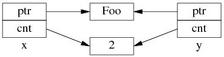

# 多线程智能指针shared_ptr的安全性

多线程环境下，调用不同shared_ptr实例的成员函数是不需要额外的同步手段的，即使这些shared_ptr拥有的是同样的对象。但是如果多线程访问（有写操作）同一个shared_ptr，则需要同步，否则就会有race condition 发生。也可以使用 [shared_ptr overloads of atomic functions](http://en.cppreference.com/w/cpp/memory/shared_ptr/atomic) 来防止race condition的发生。

shared_ptr的引用计数本身是安全且无锁的。

​     http://en.cppreference.com/w/cpp/memory/shared_ptr

二：It is only the control block itself which is thread-safe.

I put that on its own line for emphasis. The contents of the shared_ptr are not thread-safe, nor is writing to the same shared_ptr instance. Here's something to demonstrate what I mean:

```cpp
// In main()
shared_ptr<myClass> global_instance = make_shared<myClass>();
// (launch all other threads AFTER global_instance is fully constructed)
//In thread 1
shared_ptr<myClass> local_instance = global_instance;
```

This is fine, in fact you can do this in all threads as much as you want. And then when local_instance is destructed (by going out of scope), it is also thread-safe. Somebody can be accessing global_instance and it won't make a difference. The snippet you pulled from msdn basically means "access to the control block is thread-safe" so other shared_ptr<> instances can be created and destroyed on different threads as much as necessary.

```cpp
//In thread 1

local_instance = make_shared<myClass>();
```

This is fine. It will affect the global_instance object, but only indirectly. The control block it points to will be decremented, but done in a thread-safe way. local_instance will no longer point to the same object (or control block) as global_instance does.

```cpp
//In thread 2

global_instance = make_shared<myClass>();
```

This is almost certainly not fine if global_instance is accessed from any other threads (which you say you're doing). It needs a lock if you're doing this because you're writing to wherever global_instance lives, not just reading from it. So writing to an object from multiple threads is bad unless it's you have guarded it through a lock. So you can read from global_instance the object by assigning new shared_ptr<> objects from it but you can't write to it.

结论：多个线程同时读同一个shared_ptr对象是线程安全的，但是如果是多个线程对同一个shared_ptr对象进行读和写，则需要加锁。

```cpp
// In thread 3

*global_instance = 3;

int a = *global_instance;

// In thread 4

*global_instance = 7;
```

The value of a is undefined. It might be 7, or it might be 3, or it might be anything else as well. The thread-safety of the shared_ptr<> instances only applies to managing shared_ptr<> instances which were initialized from each other, not what they're pointing to.

多线程读写shared_ptr所指向的同一个对象，不管是相同的shared_ptr对象，还是不同的shared_ptr对象，也需要加锁保护。例子如下：

```cpp
shared_ptr<long> global_instance = make_shared<long>(0);
std::mutex g_i_mutex;
 
void thread_fcn()
{
    //std::lock_guard<std::mutex> lock(g_i_mutex);
 
    //shared_ptr<long> local = global_instance;
 
    for(int i = 0; i < 100000000; i++)
    {
        *global_instance = *global_instance + 1;
        //*local = *local + 1;
    }
}
 
int main(int argc, char** argv)
{
    thread thread1(thread_fcn);
    thread thread2(thread_fcn);
 
    thread1.join();
    thread2.join();
 
    cout << "*global_instance is " << *global_instance << endl;
 
    return 0;
}
```

在线程函数thread_fcn的for循环中，2个线程同时对*global_instance进行加1的操作。这就是典型的非线程安全的场景，最后的结果是未定的，运行结果如下：

```cpp
*global_instance is 197240539
```

如果使用的是每个线程的局部shared_ptr对象local，因为这些local指向相同的对象，因此结果也是未定的，运行结果如下：

```cpp
*global_instance is 160285803
```

因此，这种情况下必须加锁，将thread_fcn中的第一行代码的注释去掉之后，不管是使用global_instance，还是使用local，得到的结果都是：

```cpp
*global_instance is 200000000
```

https://stackoverflow.com/questions/14482830/stdshared-ptr-thread-safety


**三：为什么多线程读写 shared_ptr** **要加锁？**

以下内容，摘自陈硕的 http://blog.csdn.net/solstice/article/details/8547547

`shared_ptr`的**引用计数本身是安全且无锁的，但对象的读写则不是**，因为 `shared_ptr` 有两个数据成员（指向**被管理对象的指针，和指向控制块的指针**），读写操作不能原子化。根据文档(http://www.boost.org/doc/libs/release/libs/smart_ptr/shared_ptr.htm#ThreadSafety)， `shared_ptr` 的线程安全级别和内建类型、标准库容器、`std::string` 一样，即：

- 一个 `shared_ptr` 对象实体可被多个线程同时读取（文档例1）；
- 两个 `shared_ptr` 对象实体可以被两个线程同时写入（例2），“析构”算写操作；
- 如果要从多个线程读写同一个 `shared_ptr` 对象，那么需要加锁（例3~5）。

请注意，以上是 `shared_ptr` 对象本身的线程安全级别，不是它管理的对象的线程安全级别。

本文具体分析一下为什么“因为 `shared_ptr` 有两个数据成员，读写操作不能原子化”使得多线程读写同一个 shared_ptr 对象需要加锁。这个在我看来显而易见的结论似乎也有人抱有疑问，那将导致灾难性的后果，值得我写这篇文章。本文以 boost::shared_ptr 为例，与 std::shared_ptr 可能略有区别。

**1：`shared_ptr`的数据结构**

**`shared_ptr` 是引用计数型（reference counting）智能指针**，几乎所有的实现都**采用在堆（heap）上放个计数值（count）的办法**（除此之外理论上还有用循环链表的办法，不过没有实例）。具体来说，`shared_ptr<Foo>` 包**含两个成员**，一个是**指向 Foo 的指针 `ptr`，另一个是 `ref_count` 指针，指向堆上的 `ref_count` 对象**（其类型不一定是原始指针，有可能是 `class` 类型，但不影响这里的讨论）。**ref_count 对象有多个成员**，具体的数据结构如图 1 所示，**其中 `deleter` 和 `allocator` 是可选**的。

 

图 1：shared_ptr 的数据结构。

为了简化并突出重点，后文只画出 use_count 的值：

 

以上是 shared_ptr<Foo> x(new Foo); 对应的内存数据结构。

如果再**执行 shared_ptr<Foo> y = x; 那么对应的数据结构**如下。

 

**但是 y=x 涉及两个成员的复制，这两步拷贝不会同时（原子）发生**。中间步骤 1，复制 ptr 指针：

 

中间步骤 2，**复制 ref_count 指针，导致引用计数加 1**：

 

步骤1和步骤2的先后顺序跟实现相关（因此步骤 2 里没有画出 y.ptr 的指向），我见过的都是先1后2。

**既然 y=x 有两个步骤，如果没有 mutex 保护，那么在多线程里就有 race condition。**

#### 2：多线程无保护读写 shared_ptr可能出现的 race condition

考虑一个简单的场景，有 3 个 shared_ptr<Foo> 对象 x、g、n：

shared_ptr<Foo> g(new Foo); // 线程之间共享的 shared_ptr

shared_ptr<Foo> x; // 线程 A 的局部变量

shared_ptr<Foo> n(new Foo); // 线程 B 的局部变量

一开始，各安其事：

 

线程 A 执行 x = g; （即 read g），以下完成了步骤 1，还没来及执行步骤 2。这时切换到了 B 线程。

 

同时编程 B 执行 g = n; （即 write g），两个步骤一起完成了。先是步骤 1：

 

再是步骤 2：

 

这时 Foo1 对象已经销毁，x.ptr 成了空悬指针！

最后回到线程 A，完成步骤 2：

 

**多线程无保护地读写 g，造成了“x 是空悬指针”的后果**。这正是多线程读写同一个 shared_ptr 必须加锁的原因。

当然，race condition 远不止这一种，其他线程交织（interweaving）有可能会造成其他错误。

**杂项**

**shared_ptr** **作为 unordered_map** **的 key，那么要小心 hash table 退化为链表**

如果把 `boost::shared_ptr` 放到 `unordered_set` 中，或者用于 `unordered_map` 的 key。

http://stackoverflow.com/questions/6404765/c-shared-ptr-as-unordered-sets-key/12122314#12122314

直到 Boost 1.47.0 发布之前，unordered_set<std::shared_ptr<T> > 虽然可以编译通过，但是其 hash_value 是 shared_ptr 隐式转换为 bool 的结果。也就是说，如果不自定义hash函数，那么 unordered_{set/map} 会退化为链表。https://svn.boost.org/trac/boost/ticket/5216

Boost 1.51 在 boost/functional/hash/extensions.hpp 中**增加了有关重载**，现在只要包含这个头文件就能安全高效地使用 `unordered_set<std::shared_ptr>` 了。

这也是 muduo 的 examples/idleconnection 示例要自己定义 `hash_value(const boost::shared_ptr<T>& x)` 函数的原因（书第 7.10.2 节，p.255）。

因为 Debian 6 Squeeze、Ubuntu 10.04 LTS 里的 boost 版本都有这个 bug。

**为什么要尽量使用 make_shared()？**

**为了节省一次内存分配，原来 `shared_ptr<Foo> x(new Foo);` 需要为 Foo 和 ref_count 各分配一次内存，现在用 make_shared() 的话，可以一次分配一块足够大的内存，供 Foo 和 ref_count 对象容身**。数据结构是：

 

不过 Foo 的构造函数参数要传给 make_shared()，后者再传给 Foo::Foo()，这只有在 **C++11 里通过 perfect forwarding 才能完美解决**。